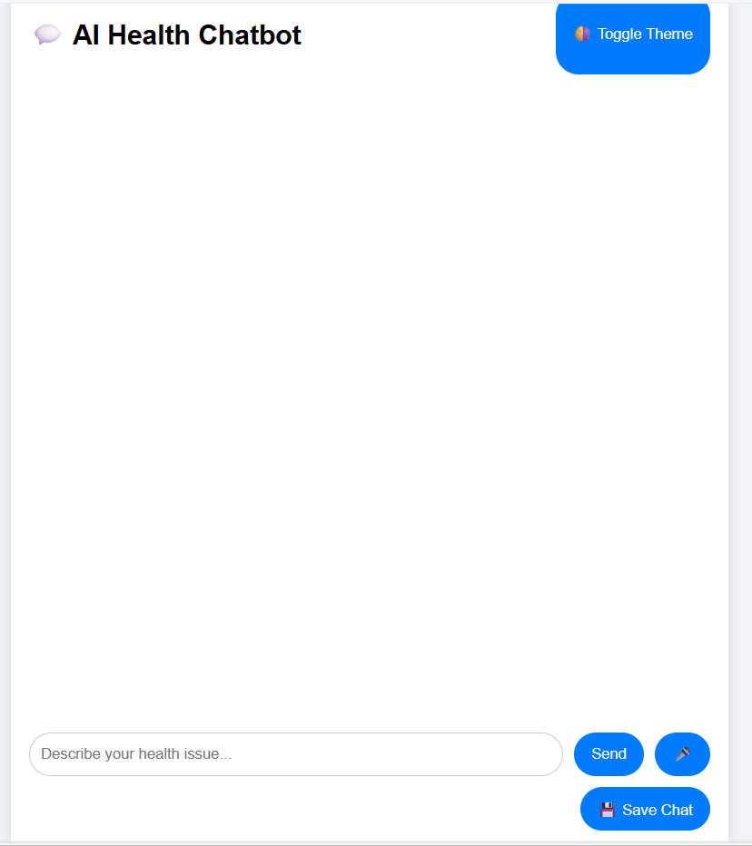

# 🤖 AI Health Chatbot

An AI-powered health chatbot built using Flask, Ollama (LLaMA2 model), and Ngrok — designed to answer health-related queries smartly and interactively.

## 🌐 Live Access (Local to Public using Ngrok)

Once running locally, the chatbot is available via Ngrok public URL. Example:
http://your-ngrok-url.ngrok.io

## 🚀 Features

- Interactive AI chatbot trained on health-related topics
- Voice-to-text input support
- Session-based chat memory
- Ngrok-powered public access
- Supports Hindi input (via Ollama)

## 💡 Tech Stack

- Python + Flask
- Ollama (LLaMA2 model)
- HTML/CSS + JS
- Ngrok (for public access)

## 🛠️ Setup Instructions

### 1. Clone this repo

```bash
git clone https://github.com/Mayank9312/healthai_chatbot.git
cd healthai_chatbot
2. Install dependencies
Make sure you have:

Python 3.10+

Flask installed

Ngrok installed

Ollama running locally with LLaMA2

3. Start Flask app
bash
Copy
Edit
python app.py

4. Create Ngrok tunnel

from pyngrok import ngrok
ngrok.set_auth_token("YOUR_AUTH_TOKEN")
public_url = ngrok.connect(5000)
print("Your public chatbot URL:", public_url)

5. Start Ollama (in another terminal)

bash
Copy
Edit
ollama run llama2

📦 Folder Structure

cpp
Copy
Edit

📁 healthai_chatbot/
│
├── app.py
├── templates/
│   └── index.html
├── static/
│   └── (your CSS/JS files if any)
├── README.md

📸 Screenshot

<h2>💬 Chatbot UI</h2>

<p align="center">
  
</p>


👨‍💻 Author
Mayank Bhardwaj – GitHub | LinkedIn

📌 Note
Make sure Ollama is running on your system while using the chatbot.

Free deployment is not possible with Ollama on the cloud unless you host it on your own server (VPS).


